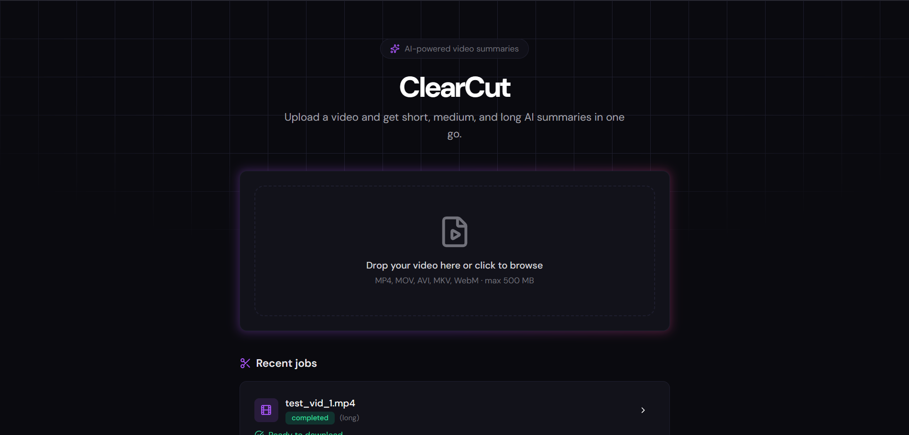
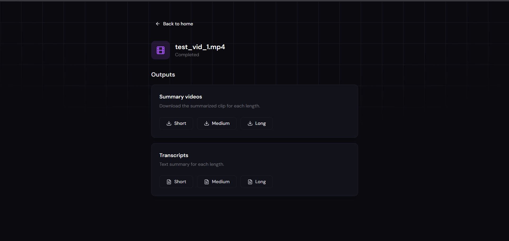

# ClearCut

**AI-powered video summarization.** Upload a video and get three summary clips (short, medium, long) with transcripts and optional evaluation metrics.

---

## What it does

1. **Upload** a video (MP4, MOV, AVI, MKV, WebM).
2. The pipeline **transcribes** audio (Groq Whisper), **analyzes** frames (Gemini/Gemma), **segments** by topic, and **summarizes** with an LLM.
3. You get **three outputs** per run: **short**, **medium**, and **long** summary videos plus their text transcripts.
4. Optional **evaluation** (BERTScore + LLM judge) writes metrics to CSV.

---

## Flow

### Home — upload and recent jobs

From the home page you upload a video (drag-and-drop or click). The app creates a job and redirects you to the job page. Recent jobs are listed with status and progress.



### Job page — progress and outputs

While the pipeline runs you see the current step and a progress bar. When it finishes, summary videos and transcripts appear. Download any of the three lengths (short / medium / long).



---

## Tech stack

| Layer | Stack |
|-------|--------|
| **Frontend** | React 19, Vite, TypeScript, Tailwind CSS, shadcn-style UI, Framer Motion, Lucide React |
| **Backend** | Python 3.11, FastAPI, Uvicorn |
| **Pipeline** | Groq (Whisper), Google GenAI (Gemini/Gemma), NLTK, sentence-transformers, BERTScore, FFmpeg |
| **Deploy** | Docker, Docker Compose, Nginx (frontend), CPU-only PyTorch, uv for installs |

The backend runs the summarization pipeline in a **thread pool** so the API stays responsive during long runs. Nginx proxy timeouts are set to 10 minutes for `/api`.

---

## Docker setup

### Prerequisites

- [Docker](https://docs.docker.com/get-docker/) and [Docker Compose](https://docs.docker.com/compose/install/)
- **API keys** (see below)

### 1. Clone and env

```bash
git clone <repo-url>
cd ClearCut
cp .env.example .env
```

Edit `.env` and set:

```env
GROQ_API_KEY=your_groq_api_key
GEMMA_API_KEY=your_google_gemini_or_gemma_key
```

Get keys:

- **GROQ_API_KEY**: [console.groq.com](https://console.groq.com/) (for Whisper transcription).
- **GEMMA_API_KEY**: Google AI Studio / Gemini API key (for vision and summarization).

### 2. Build and run

From the project root:

```bash
docker compose up --build -d
```

- **App (UI):** [http://localhost](http://localhost) (port 80)
- **API:** [http://localhost:8000](http://localhost:8000)

### 3. Use the app

1. Open [http://localhost](http://localhost).
2. Upload a video (max 500 MB by default).
3. You’re taken to the job page; progress updates every few seconds.
4. When status is **completed**, download **short**, **medium**, or **long** summary videos and transcripts.

### Clean rebuild

To remove containers, volumes, images, and build cache and start fresh:

```bash
docker compose down -v --rmi all --remove-orphans
docker network prune -f
docker builder prune -af
docker compose up --build -d
```

---

## Outputs explained

For each job the pipeline produces **three summary lengths**:

| Length | Description |
|--------|-------------|
| **Short** | ~3–4 sentences; most condensed. |
| **Medium** | ~6–8 sentences; balanced. |
| **Long** | ~10+ sentences; most coverage. |

Per length you get:

- **Summary video** — clip built from the segments selected for that length (`summary_short.mp4`, `summary_medium.mp4`, `summary_long.mp4`).
- **Transcript** — plain-text summary (`short_transcript.txt`, etc.).

Inside Docker, artifacts live in the `clearcut_workspace` volume under a folder named by **job ID**. Evaluation results (if enabled) are appended to `evaluation_results.csv` in the backend container.

---

## Project layout

```
ClearCut/
├── app/                    # Pipeline: transcription, vision, segmentation, summarization, eval
├── backend/                # FastAPI API and job runner
├── frontend/               # React SPA (Vite, Tailwind)
├── screenshots/            # README screenshots
├── docker-compose.yml
├── .env.example
├── DEPLOYMENT.md           # Detailed deploy and local-dev notes
└── README.md
```

For local development (no Docker), see [DEPLOYMENT.md](DEPLOYMENT.md).

---

## License

See repository license file.
